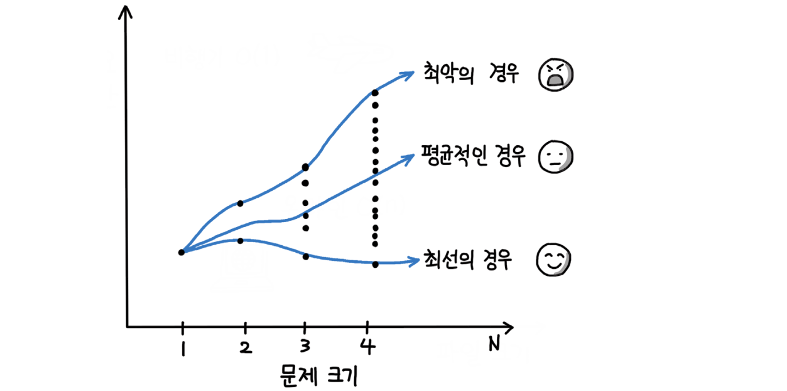
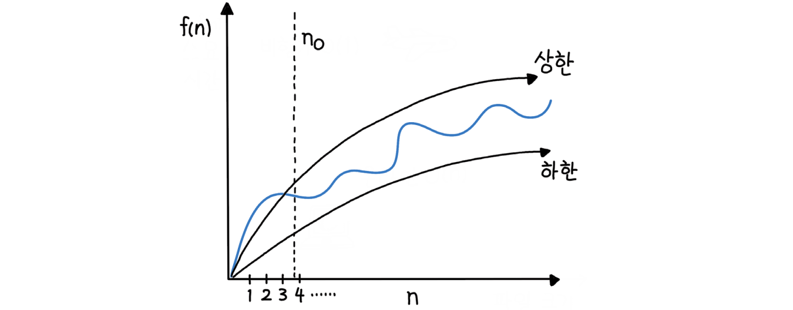
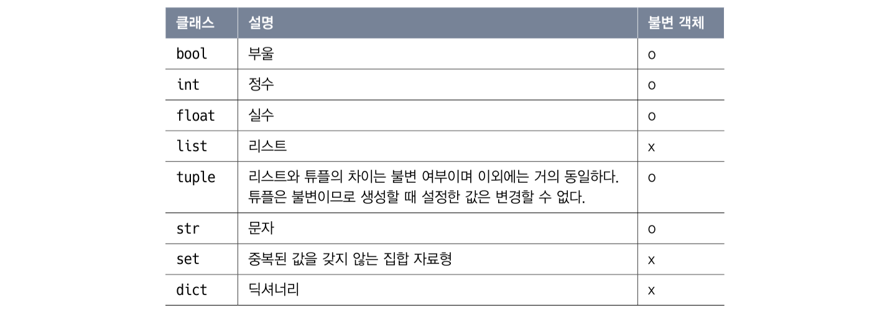

# 4장 빅오, 자료형
## 빅오

빅오(O, big-O)란 입력값이 무한대로 향할 때 함수의 상한을 설명하는 수학적 표기 방법이다.

점근적 실행 시간(Asymptotic Running Time)을 표기할 때 가장 널리 쓰이는 수학적 표기법

점근적 실행 시간: 입력값 n이 커질 때, 즉 입력값이 무한대를 향할 때 $lim$ 함수의 실행 시간의 추이를 의미

컴퓨터의 빠른 처리 능력을 감안하면 입력의 크기가 작으면 금방 끝나버린다. 그러므로 충분히 큰 입력을 주어 알고리즘의 효율성에 따른 수행 시간을 알아보아야 한다.

입력값이 커질 때 알고리즘의 실행 시간(시간 복잡도)과 함께 공간 요구사항(공간 복잡도)이 어떻게 증가하는지 분류하는데 사용

알고리즘의 효율성 분석에서 유용하게 활용

점근적 실행 시간의 예시로 디스크에 있는 파일을 친구에게 보낼 때 

파일 크기가 작다면, 즉 $n$이 작다면 $O(n)$의 시간이 걸리는 온라인 전송이 빠르다. 

하지만 파일이 아주 크다면, 항상 일정한 시간이 소요되는($O(1)$의 시간이 걸리는) 비행기를 통해 물리적으로 배달하는 게 더 빠를 수 있다. (비용을 고려하지 않는다면)


점근적 실행 시간은 시간 복잡도라고 말할 수 있다.

시간 복잡도(Time Complexity)의 사전적 정의는

어떤 알고리즘을 수행하는 데 걸리는 시간을 설명한은 계산 복잡도(Computational Complexity)이다.

빅오로 시간 복잡도를 표현할 때는 최고차항만을 표기하며, 상수항은 무시한다.

ex) 입력값 $n$에 대해 $4n^2+3n+4$번 만큼 계산하는 함수가 있다면 이 함수의 시간 복잡도는 최고차항인 $4n^2$만을 고려한다.

이 중에서도 계수는 무시하며 $n^2$만을 고려한다.

즉, 여기서의 시간 복잡도는 $O(n^2)$이 된다.

### 빅오 표기법의 종류

- $O(1)$

    입력값이 아무리 커도 실행 시간은 일정한 최고의 알고리즘

    그러나 상수값이 상상을 넘어설 정도로 매우 크다면 사실상 의미가 없다.

    ex) 해시 테이블의 조회 및 삽입

- $O(logn)$

    여기서부터는 실행 시간은 입력값에 영향을 받는다. 그러나 로그는 매우 큰 입력값에도 크게 영향을 받지 않는 편으로 웬만한 $n$의 크기에 대해서도 매우 견고하다.

    ex) 이진 검색

- $O(n)$

    입력값만큼 실행 시간에 영향을 받으며, 알고리즘을 수행하는 데 걸리는 시간이 입력값에 비례한다.

    선형 시간(Linear-Time) 알고리즘이라고 한다.

    ex) 정렬되지 않은 리스트에서 최댓값 또는 최솟값을 찾는 경우(모든 입력값을 적어도 한 번 이상은 살펴봐야 한다.)

- $O(nlogn)$

    ex) 병합 정렬 등의 효율 좋은 정렬 알고리즘

    적어도 모든 수에 대해 한 번 이상은 비교해야 하는 비교 기반 정렬 알고리즘은 $O(nlogn)$보다 빠를 수 없다

    입력값이 최선인 경우 비교를 건너뛰어 $O(n)$이 될 수 있으며 팀소트(Timesort)가 이에 해당한다.

- $O(n^2)$

    ex) 버블 정렬과 같은 비효율적인 정렬 알고리즘

- $O(2^n)$

    ex) 피보나치 수를 재귀로 계산하는 알고리즘

- $O(n!)$

    ex) 각 도시를 방문하고 돌아오는 가장 짧은 경로를 찾는 외판원 문제(Traveling Salesman Problem, TSP)를 브루트 포스로 풀이할 경우

    가장 느린 알고리즘으로, 입력값이 조금만 커져도 웬만한 다항 시간 내에는 계산이 어렵다.

    n=100만 되어도 n!은 무려 9332621544394415268 16992388562667004907159682643816214685929638952175999932299156 08941463976156518286253697920827223758251185210916864000000000 000000000000000이 된다.

빅오는 시간 복잡도 외에도 공간 복잡도를 표현하는 데에도 널리 쓰인다.

알고리즘의 주요한 특징 중 하나는

"시간과 공간이 트레이드오프(Space-Time Tradeoff)" 관계라는 것이다.

이 말은 실행 시간이 빠른 알고리즘은 공간을 많이 사용하고 공간을 적게 차지하는 알고리즘은 실행 시간이 느리다는 의미히다. (살행 시간이 빠르면서도 공간을 적게 차지하는 알고리즘은 드물게 존재할 수 있다.)

### 상한과 최악

빅오($O$)는 상한(Upper Bound)를 의미한다.

이외에도 하한(Lower Bound)을 나타내는 빅오메가($Ω$), 평균을 의미하는 빅세타($Θ$)가 있다.

상한으로만 시간을 표현하는 방법이 틀리지 않고 매번 구분하는 것이 번거롭고 혼동되기 때문에,

업계에서는 빅세타와 빅오를 하나로 합쳐서 빅오로 표현하려는 경향이 있다.

한 가지 중요한 점은,

빅오 표기법은 정확하게 쓰기에는 너무 길고 복잡한 함수를 '적당히 정확하게' 표현하는 방법일 뿐이라는 것이다.

최악의 경우/평균적인 경우의 시간 복잡도와는 아무런 관계가 없는 개념이라는 것에 유의해야 한다.

### 최선, 평균, 최악의 복잡도

다음 그림은 문제 크기에 따른 최선, 평균, 최악의 복잡도를 나타낸 것이다.



입력값이 $[1, 4, 3, 7, 8, 6, 5]$일 때 퀵 정렬의 로무토 파티션(Lomuto Partition, 피벗을 정할 때 가장 우측을 택하는 가장 단순한 피벗 선택 방식)에서 이 입력밧은 최선의 경우에 해당한다.

총 18번의 비교 또는 스왑 연산이 필요하고, 시간 복잡도는 $O(nlogn)$에 가깝다.

반면 입력값이 $[1, 2, 3, 4, 5, 6,  7]$이라면 48번의 연산을 수행하고, 최악의 경우에 해당한다.

시간 복잡도는 $O(n^2)$에 가깝다.

즉, $n=7$일 때 최선, 평균, 최악의 연산 횟수는 각각 18, 24, 48이며 이 값은 $n$이 점점 커져도 비슷한 비율로 유지될 것이다. 여기까지는 빅오와 관련이 없는 최선/평균/최악의 '경우'에 해당된다.

### 상한과 하한

반면, 빅오 표기는 아래 그림과 같은 복잡한 함수 $f(n)$이 있을 경우, 이 함수의 실행 상한과 하한을 의미한다.



가장 빨리 실행될 때가 하한, 가장 늦게 살행될 때가 상한을 뜻한다.

이 중 가장 늦게 실행 될 때는 빅오,

가장 빨리 실행될 때를 빅오메가,

평균적으로는 빅세타로 지칭한다.

값이 작은 경우는 무시하며, $n$이 매우 클 때의 전체적인 큰 그림에 집중한다.

퀵 정렬의 예를 들어 말하자면 '최선의 경우 $O(nlogn)$이다'라고 표현할 수 있다.

```
💡 빅오 표기법은 주어진(최선/최악/평균) 경우의 수행 시간의 상한을 나타낸다.
```


### 분할 상환 분석

알고리즘의 복잡도를 계산할 때 알고리즘 전체를 보지 않고 최악의 경우만을 살펴보는 것은 지나치게 비관적이다.

대표적인 예로 '동적 배열'이 있다.

동적 배열에서 더블링이 일어나는 일은 어쩌다 한 번뿐이지만, 이로 인해 '아이템 삽입 시 시간 복잡도는 $O(n)$이다.'라고 이야기하는 건 정확하지 않다는 것이다.

따라서 이 경우 분할 상환 분석(Amortized Analysis)이라고 하는,

최악의 경우를 여러 번에 걸쳐 골고루 나눠주는 형태로 알고리즘의 시간 복잡도를 계산할 수 있다.

1985년 미국의 수학자이자 컴퓨터과학자인 로버트 타잔(Robert Tarjan)이 '상각된 계산 복잡도(AmortizedComputational Complexity)'라는 논문에서 처음으로 소개했다.

### 병렬화

일부 알고리즘들은 병렬화로 실행 속도를 높일 수 있다.

GPU는 병렬 연산을 위한 대표적인 장치로, 수천여 개의 코어로 구성되어 있어 많아 봐야 수십여 개에 불과한 CPU보다 수백 배 더 많은 연산을 동시에 수행할 수 있다.

→ CPU가 비행기로 짐을 여러 번 나르는 것이라면, GPU는 배로 수많은 짐을 한 번에 나르는 것, 결국 GPU는 같은 시간에 목적지에 훨씬 더 많은 짐을 나를 수 있다.

딥러닝의 인기와 함게 각광받고 있으며, 알고리즘의 우수성을 평가하는 척도 중 하나이기도 하다.

---

## 자료형

파이썬의 자료형, 파이썬 자료형의 특징, 리스트와 딕셔너리에 대해 중점

### 파이썬 자료형


- 숫자
    - `int` : 숫자 정수형

        `int` 는 C 스타일의 고정 정밀도(Fixed-Precision) 정수형이었고 `long` 은 임의 정밀도(Arbitrary-Precision) 정수형이었다.

        버전 2.4부터는 `int` 가 충분하지 않으면 자동으로 `long` 타입으로 변경되는 구조가 됐으며 오버플로(Overflow)가 발생하는 일은 사라졌다.

        버전 3부터는 아예 `int` 단일형으로 통합됐다. 임의 정밀도를 지원하며, 더 이상 파이썬에서 고정 정밀도 정수형은 지원하지 않게 됐다.

        임의 정밀도 정수형이란 무제한 자릿수를 제공하는 정수형을 말한다.
        정수를 숫자의 배열로 간주하는 것으로, 자릿 단위로 쪼개어 배열 형태로 표현한다.
        오버플로를 고민할 필요가 없어 잘못된 계산 오류를 방지할 수 있다.

        파이썬에서는 기본 정수형인 `int` 가 임의 정밀도 연산만을 지원하는데,
        이는 "기능과 안전"을 위해 "속도"를 맞바꾼 셈이다.

    - `bool`

        엄밀히 따지면 논리 자료형인데  파이썬에서는 내부적으로 1(`True`)과 0(`False`)으로 처리되는 `int`의 서브 클래스이다. 

        `int` 는 `object` 의 하위 클래스이기도 하기 때문에,

        `object` > `int` > `bool` 과 같은 구조를 띤다.

- 매핑

    매핑(Mapping) 타입은 키와 자료형으로 구성된 복합 자료형으로 파이썬에서는 `dictionary` 이다.

- 집합

    파이썬의 집합 자료형인 `set` 은 중복된 값을 갖지 않는 자료형이다.

```python
# 빈 집합의 선언
a = set()
# 값이 포함된 집합 선언
# 딕셔너리와 동일하게 중괄호를 사용하므로 유의
a = {'a', 'b', 'c'}
# 딕셔너리의 선언
# 키(Key)/값(Value) 형태
a = {'a':'A', 'b':'B', 'c':'C'}
```

`set` 은 입력 순서가 유지되지 않으며, 중복된 값이 있을 경우 하나의 값만 유지한다.


```python
>>> a = {3, 2, 3, 5}
>>> a
{2, 3, 5}
```


- 시퀀스

    시퀀스(Sequence)는 우리말로 하면 '수열'과 같은 의미로 순서 있는 나열을 뜻한다.

    `str` 은 문자의 순서 있는 나열로 문자열을 이루는 자료형이며,

    `list` 는 다양한 값들을 배열 형태의 순서 있는 나열로 구성하는 자료형이다.

    - 가변(Mutable)
      
        - `list` : 자유롭게 값을 추가, 삭제할 수 있는 동적 배열
    - 불변(Immutalbe): 값을 변경할 수 없다. 한번 이 타입으로 선언되는 값은 변경할 수가 없다.
        - `tuple`
        - `bytes`
    - `str`
    
```python
>>> a = 'abc'
>>> a[1] = 'd'
Traceback (most recent call last):
File "<stdin>", line 1, in <module> 
TypeError: 'str' object does not support item assignment
```

### 원시 타입

C나 자바 같은 프로그래밍 언어들은 원시 타입(Primitive Type)을 제공한다.

C나 자바는 성능에 대한 우선순위가 높은 언어이기 때문이다.

원시 타입은 메모리에 정확하게 타입 크기만큼의 공간을 할당하고 그 공간을 오로지 값으로 채워 넣는다.

만약 C에서 배열이라면 

물리 메모리(Physical Memory)에 자료형의 크기만큼 공간을 갖는 요소가 연속된 순서로 배치되는 형태가 된다.

자바에서는 원시 타입을 제공하고, 원시 타입과 대응되는 객체를 갖고 있다.

원시 타입을 객체로 변환하면 여러 가지 작업을 수행할 수 있게 된다.

- 문자 변환
- 16진수 변환
- 시프팅(Shifting)

→ 여러 가지 부가 정보가 추가되므로, 메모리 점유율이 늘어나고 계산 속도 또한 감소한다.

`bool` 원시 타입은 단 1비트에 불과하지만,

객체인 `Boolean` 은 무려 128비트나 차지한다.

이처럼 객체는 편리하고 다양한 기능을 제공하기 위해 일정 부분 속도와 공간을 희생하게 된다.

그러나 파이썬은 애초에 편리한 기능 제공에 우선순위를 둔 언어이다.

따라서 원시 타입을 지원하지 않는다.

느린 속도와 더 많은 메모리를 차지하더라도 훨씬 더 다양한 기능을 제공할 수 있는 객체에 관심을 두는 것이다.

### 객체

파이썬은 모든 것이 객체이고, 크게 불변 객체와 가변 객체로 구분할 수 있다.



- 불변 객체

    파이썬에서 변수를 할당하는 작업은 해당 객체에 대해 참조를 한다는 의미다.

    파이썬은 모든 것이 객체이기 때문에 여기에는 예외가 없으며 심지어 문자와 숫자도 모두 객체다.

```python
10
>>> a = 10
>>> b = a >>> id(10), id(a), id(b)
(4393858752, 4393858752, 4393858752)
```

값을 담고 있는 변수는 사실은 참조일 뿐이고 살제로 값을 갖고 있는 `int` 와 `str` 은 모두 불변 객체다.
	
`tuple` 또한 불변 색체로 한번 값을 담아두면 더 이상 값을 변경할 수 없다.
	
상수처럼 read-only 용도로 사용하거나 `dict` 의 키나 `set` 의 값으로도 사용할 수 있다. (`list` 는 불가)

- 가변 객체

    가변 객체는 값이 바뀔 수 있으며, 다른 변수가 참조하고 있을 때 그 변수의 값 또한 변경된다는 의미이다.

```python
>>> a = [1, 2, 3, 4, 5] 
>>> b = a 
>>> b
[1, 2, 3, 4, 5]

>>> a[2] = 4
>>> a
[1, 2, 4, 4, 5]
>>> b
[1, 2, 4, 4, 5]
```


```
	💡 C++ 참조와 비교
	C++의 참조(Reference) 방식은 파이썬의 참조 할당 방식과는 조금 다르다.
```


```cpp
int a = 10;
int &b = a;
b = 7;

std::cout << a << std::endl;

// 실행 결과
// 7
```

```python
>>> a = 10
>>> b = a 
>>> id(a), id(b)
(4550522560, 4550522560)
>>> b = 7
>>> a, id(a), id(b)
(10, 4550522560, 4550522464)
```

→ 불변 객체는 값의 변경이 불가능하기 때문에 이처럼 참조 변수에서 값을 조작할 수 있는 방법이 없다.
	
그러나 리스트와 같은 가변 객체를 참조하고 있다면 참조 대상의 변수도 변경할 수 있게 된다.
	
다만 이 경우에도 `=` 연산자로 재할당을 하게 되면 다른 ID가 되므로 주의가 필요하다.
	
`is` 와 `==`
`is` 는 `id()` 값을 비교하는 함수이고,
`==` 는 값을 비교하는 연산자이다.
	
`None` 은 널(null)로서 값 자체가 정의되어 있지 않으므로 `==` 로 비교가 불가능하다.

```python
>>> a = [1, 2, 3]
>>> a = copy.deepcopy(a)
True
>>> a is copy.deepcopy(a)
False
```

→ 복사한 값은 같지만 ID는 다르기 때문에 `==` 로 비교하면 `True`, `is` 로 비교하면 `False` 가 된다.

- 속도

    파이썬 객체 구조는 잘 설계되어 있고 매우 편리하고 강력한 긴으을 제공한다.

    문제는 속도이다.

    C나 자바 같은 다른 언어에 비해 느린 중요한 이유 중 하나이기도 하다.

    파이썬은 왜 원시 타입 배열을 사용하지 않고, 굳이 리스트를 사용하거나 객체를 사용할까?

    자세한 내용은 바로 다음 5장에서 자세히 살펴본다.


```
💡자료구조, 자료형, 추상 자료형
- 자료구조
데이터에 효율적으로 접근하고 조작하기 위한 데이터의 조직, 관리, 저장 구조
학문으로서의 자료구조를 일컫는다.
일반적으로 원시 자료형을 기반으로 하는 배열, 연결 리스트, 객체 등을 말한다. (복잡 자료형(Composite Data Type))
- 자료형
컴파일러 또는 인터프리터에게 프로그래머가 데이터를 어떻게 사용하는지 알려주는 데이터 속성
정수, 실수, 문자열 등 원시 자료형까지 포함하는 모든 자료의 유형
- 추상 자료형 ADT
자료형에 대한 수학적 모델을 지칭하는 것으로, 해당 유형의 자료에 대한 연산들을 명기한 것
행동만을 정의할 뿐 실제 구현 방법은 명시하지 않는다.
이는 OOP의 추상화가 비슷한 개념으로 볼 수 있다.
```