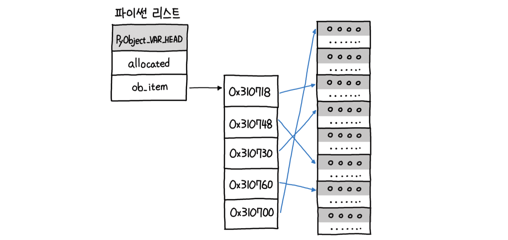

# 5장 리스트, 딕셔너리
## 리스트

리스트(List)는 순서대로 저장하는 시퀀스이자 변경 가능한 목록(Mutable List)를 말한다.

입력 순서가 유지되며, 내부적으로는 동적 배열로 구현되어 있다.

(C++에서는 `std::vector` , 자바에서는 `ArrayList` 가 동적 배열을 구현한 자료형이다.)

파이썬 리스트의 가장 좋은 점은 매우 다양한 기능을 제공한다는 점이다.

스택을 사용할지, 큐를 사용할지 고민하지 않아도 되며, 스택과 큐에서 사용 가능한 모든 연산을 함께 제공한다.

코딩 테스트 시 다른 언어에 비해 매우 유리한 조건을 갖게 되는 셈이다.

- 리스트의 주요 연산 시간 복잡도

| 연산           | 시간 복잡도 | 설명                                                         |
| -------------- | ----------- | ------------------------------------------------------------ |
| len(a)         | O(1)        | 전체 요소의 개수를 리턴한다.                                 |
| a[i]           | O(1)        | 인덱스 i의 요소를 가져온다.                                  |
| a[i:j]         | O(k)        | i부터 j까지 슬라이스의 길이만큼인 k개의 요소를 가져온다. 이 경우 객체 k개에 대한 조회가 필요하다. |
| elem in a      | O(n)        | elem 요소가 존재하는지 확인한다. 처음부터 순차탐색하므로 n만큼 시간이 소요된다. |
| a.count(elem)  | O(n)        | elem 요소의 개수를 리턴한다.                                 |
| a.index(elem)  | O(n)        | elem 요소의 인덱스를 리턴한다.                               |
| a.append(elem) | O(1)        | 리스트 마지막에 elem 요소를 추가한다.                        |
| a.pop()        | O(1)        | 리스트 마지막 요소를 추출한다. (스택 연산)                   |
| a.pop(0)       | O(n)        | 리스트 첫번째 요소를 추출한다. (스택 연산) 큐의 연산이기도 함. 큐의 연산을 사용할 때 주의해야 하는데 Deque같은 자료형으로 성능을 높일 수 있음. |
| del a[i]       | O(n)        | i에 따라 다르고, 최악의 경우 O(n)이다.                       |
| a.sort()       | O(nlogn)    | 정렬. Timsort를 사용하며, 최선의 경우 O(n)에도 실행될 수 있다. |
| min(a), max(a) | O(n)        | 최솟값/최댓값을 계산하기 위해서는 전체를 선형 탐색해야 한다. |
| a.reverse()    | O(n)        | 뒤집기. 리스트는 입력 순서가 유지되므로 뒤집게 되면 입력 순서가 반대로 된다. |

리스트의 경우 탐색 시 값의 존재 유무를 확인하려면 정렬된 경우 이진 검색이 효율적이다.

그러나 매번 정렬이 필요하기 때문에 리스트의 경우에는 모든 엘리먼트를 순차적으로 조회하는 형태로 구현되어 있다. 이 경우 최악의 경우 O(n)이 소요된다.

### 리스트의 활용 방법

- 선언 및 삽입

```python
# 비어있는 리스트 선언의 2가지 방법
>>> a = list()
>>> a = []

# 초깃값 지정 선언
>>> a = [1, 2, 3]
# 값 추가
>>> a.append(4)
[1, 2, 3, 4]

# 특정 위치 인덱스를 지정해 요소 추가
# 인덱스 3에 5를 삽입
>>> a.insert(3, 5)
[1, 2, 3, 5, 4]

# 숫자 외에도 문자와 불리언을 자유롭게 삽입할 수 있다.
>>> a.append('안녕')
>>> a.append(True)
>>> a
[1, 2, 3, 5, 4, '안녕', True]
# 타입 변환 등의 별도 부가 처리 없이 유연하게 활용할 수 있다.
# 매우 편리하며 생산성이 매우 높다.
```

- 슬라이싱 및 값 가져오기

```python
# 값을 꺼내올 때는 인덱스 지정
>>> a[3]
5

# 슬라이싱(Slicing) 기능이 있어 특정 범위 내의 값을 매우 편리하게 가져올 수 있다.
# 문자열에 유용하게 활용되는 슬라이싱은 리스트에도 동일한 형태로 활용 가능하다.
# 인덱스 1에서 인덱스 3 이전까지의 값 가져오기
>>> a[1:3]
[2, 3]

# 반복문 구성/순회 없이 시작, 종료 인덱스 설정으로 간단히 출력 가능하다.
# 시작 인덱스 생략
>>> a[:3]
[1, 2, 3]
# 종료 인덱스 생락
>>> a[4:]
[4, '안녕', True]

# 홀수 번째 인덱스의 값 가져오기
# 세 번째 파라미터를 부여하면 단게(Step)의 의미로, 
# [1:4:2]와 같이 단계를 2로 지정하면 두 칸씩 건너 뛰게 된다.
>>> a[1:4:2]
[2, 5]

# 존재하지 않는 인덱스를 조화할 경우 IndexError 발생
>>> a[9]
Traceback (most recent call last):
  File "<stdin>", line 1, in <module> 
IndexError: list index out of range

# 인덱스가 리스트의 길이를 넘어설 때 발생, try 구문으로 예외처리 가능
try:
    print(a[9])
except IndexError:
    print('존재하지 않는 인덱스')
```

- 값 삭제

```python
# 리스트 요소를 삭제하는 방법 2가지
# 인덱스로 삭제하기: del 키워드
>>> del a[1]
>>> a
[1, 3, 5, 4, '안녕', True]
# 값으로 삭제하기: remove 함수
a.remove(3)
[1, 5, 4, '안녕', True]
# pop 함수 - 스택의 pop 연산처럼 추출로 처리
# 삭제될 값을 리턴하고 삭제됨
>>> a.pop(3)
'안녕'
>>> a
[1, 5, 4, True]
```

### 리스트의 특징

파이썬의 리스트는 연속된 공간에 요소를 배치하는 배열의 장점과,

다양한 타입을 연결해 배치하는 연결 리스트의 장점을 모두 취한 듯한 형태를 띤다.

잘 사용하기만 하면 배열과 연결 리스트가 모두 필요 없을 정도로 강력하다.

- CPython에서 리스트를 정의한 헤더 파일의 일부

```python
// cpython/Include/cpython/listobject.h 
typedef struct { 
    PyObject_VAR_HEAD 
    PyObject **ob_item;
    Py_ssize_t allocated;
} PyListObject;
```

→ 요소에 대한 포인터 목록 `ob_item` 을 갖고 있는 구조체로 선언되어 있다.

리스트에 요소를 추가하거나 조작하기 시작하면 `ob_item` 의 사이즈를 조절해 나가는 형태로 구현되어 있다.

파이썬의 모든 자료형은 객체로 되어 있다.

리스트는 이처럼 객체로 되어 있는 모든 자료형을 다음과 같이 포인터로 연결한다.



→ 객체에 대한 포인터 목록을 관리하는 형태

→ 사실상 연결 리스트에 대한 포인터 목록을 배열 형태로 관리하고 있음

→ 배열과 연결 리스트를 합친 듯이 강력한 기능을 지원

리스트는 연결 리스트에 대한 포인터 목록을 관리하고 있기 때문에 제각기 다양한 타입을 동시에 단일 리스트에서 관리하는 것이 가능하다.

이러한 특징은 매우 강력하고 편리하다.

그러나 각 자료형의 크기는 저마다 서로 다르기 때문에 연속된 메모리 공간에 할당할 수 없고,

각각의 객체에 대한 참조로 구현되어 있다.

인덱스를 조회하는 데에도 모든 포인터의 위치를 찾아가서 타입 코드를 확인하고 값을 일일이 살펴봐야 하는 등의 추가 작업이 필요하기 때문에, 속도면에서 불리하다.

속도를 희생한 대신 강력한 기능을 위해 리스트와 객체에 대한 참조를 택한 것이다.

---

## 딕셔너리

파이썬 딕셔너리는 키/값 구조로 이루어진 딕셔너리를 말한다.

파이썬 버전 3.7 이상에서는 입력 순서가 유지되며, 니부적으로는 해시 테이블(Hash Table)로 구현되어 있다.

(C++에서는 `std::unordered_map` , 자바에서는 `HashMap` 가 해시 테이블을 구현한 자료형이다.)

인덱스를 숫자로만 지정할 수 있는 리스트와 달리,

딕셔너리는 문자를 포함해 다양한 타입을 키로 사용할 수 있다.

해시만 할 수 있다면 숫자, 문자, 집합까지 불변 객체를 모두 키로 사용할 수 있다.

이 과정을 해싱이라고 하며, 해시 테이블을 이용해 자료를 저장한다.

해시 테이블은 최악의 경우 O(n)이 될 수 있으나 대부분의 경우 훨씬 더 빨리 실행되며,

분할 상환 분석에 따른 시간 복잡도는 O(1)이다.

- 딕셔너리의 주요 연산 시간 복잡도

| 연산           | 시간 복잡도 | 설명                                 |
| -------------- | ----------- | ------------------------------------ |
| len(a)         | O(1)        | 요소의 개수를 리턴한다.              |
| a[key]         | O(1)        | 키를 조회하여 값을 리턴한다.         |
| a[key] = value | O(1)        | 키/값을 삽입한다.                    |
| key in a       | O(1)        | 딕셔너리에 키가 존재하는지 확인한다. |

파이썬 3.6 이하 버전에서는 딕셔너리는 입력 순서가 유지되지 않았다.

`collections.OrderdDict()` 라는 별도 자료형을 제공했다. 그러나 3.7부터는 내부적으로 인덱스를 이용해 입력 순서를 유지하도록 개선됐다.

이외에도 조회 시 항상 디폴트 값을 생성해 키 오류를 방지하는 `collections.defaultsduct()`

요소의 값을 키로 하고 개수를 값 형태로 만들어 카운팅하는 `collections.Counter()` 등이 있다.

이 `collections` 모듈에서 지원하는 기능들은 앞으로 이 책에서 코딩 테스트 문제를 풀이하는 데에도 매우 유용하게 활용할 것이다.

### 딕셔너리의 활용 방법

- 딕셔너리 선언

```python
# 비어있는 딕셔너리 선언
>>> a = dict()
>>> a = {}

# 초기값으로 지정해 선언
>>> a = {'key1': 'vaule1', 'key2',: 'value2'}
>>> a
{'key1': 'value1', 'key2': 'value2'}
# 별도로 선언하여 값 할당
>>> a['key3'] = 'value3'
>>> a
{'key1': 'value1', 'key2': 'value2', 'key3': 'value3'}
```

- 딕셔너리 값 조회

```python
# 키를 지정하여 값 조회
>>> a['key1']
'value1'
# 존재하지 않는 키 조회 시 에러 발생
>>> a['key4']
Traceback (most recent call last):
  File "<stdin>", line 1, in <module> 
KeyError: 'key4'

# 예외 처리
try:
	print(a['key4'])
except KeyError:
	print('존재하지 않는 키')

# for 루프를 통한 조회
>>> for k,v in a.items():
        print(k,v)
key1 value1
key2 value2
key3 value3
```

- 딕셔너리 값 삭제

```python
# 딕셔너리 값 삭제
>>> del a['key1']
>>> a
{'key2': 'value2', 'key3': 'value3'}

# 존재하지 않는 값 삭제 시 발생
>>> del a['key4']
Traceback (most recent call last):
  File "<stdin>", line 1, in <module>
KeyError: 'key4'

# 예외 처리
>>> 'key4' in a
False
>>> if 'key4' in a:
        print('존재하는 키')
    else:
        print('존재하지 않는 키')
존재하지 않는 키
```

### 딕셔너리 모듈

- defaultdict 객체

    존재하지 않는 키를 조회할 경우, 에러 메시지 대신 디폴트 값을 기준으로 해당 키에 대한 딕셔너리 아이템을 생성해준다. `collections.defaultsdict` 클래스를 갖는다.

```python
>>> a = collections.defaultdict(int)
>>> a['A'] = 5
>>> a['B'] = 4
>>> a
defaultdict(<class 'int'>, {'A': 5, 'B': 4})

>>> a['C'] += 1
>>> a
defaultdict(<class 'int'>, {'A': 5, 'B': 4, 'C': 1})
```

- Counter 객체

    아이템에 대한 개수를 계산해 딕셔너리로 리턴한다.

    Counter 객체 키에는 아이템의 값이, 값에는 해당 아이템의 개수가 들어간 딕셔너리를 생성한다.

    개수를 자동으로 계산해주기 때문에 매우 편리하며 다양하게 활용된다.

```python
>>> a = [1, 2, 3, 4, 5, 5, 5, 6, 6]
>>> b = collections.Counter(a)
>>> b
Counter({5: 3, 6: 2, 1: 1, 2: 1, 3: 1, 4: 1}) 

# 딕셔너리를 한 번 더 래핑(Wrapping)한 collections.Counter 클래스
>>> type(b)
<class 'collections.Counter'>

# 가장 빈도 수가 높은 요소 추출
>>> b.most_common(2)
[(5, 3), (6, 2)]
```

- OrderedDict 객체

    입력 그대로 순서가 유지된다.

    파이썬 3.7부터 딕셔너리는 입력 순서가 유지되도록 개선됬다.

    `OrderedDict` 는 순서와 관련된 몇 가지 추가 메소드를 제공한다는 점 이외에는 사실상 하위 호환성을 위해서만 남겨졌다.

    그러나 코딩 테스트 시 하위 버전의 파이썬 인터프리터를 사용하는 경우가 있고,

    원래 해시 테이블은 입력 순서에 관연하지 않는 자료형인 만큼 무턱대고 딕셔너리로 입력 순서를 기대하는 것은 매우 위험하며 권장하지도 않는 방법이다.

```python
>>> collections.OderedDict({'banana': 3, 'apple': 4, 'pear': 1, 'orange': 2})
OrderedDict([('banana': 3), ('apple': 4), ('pear': 1), ('orange': 2)])
```