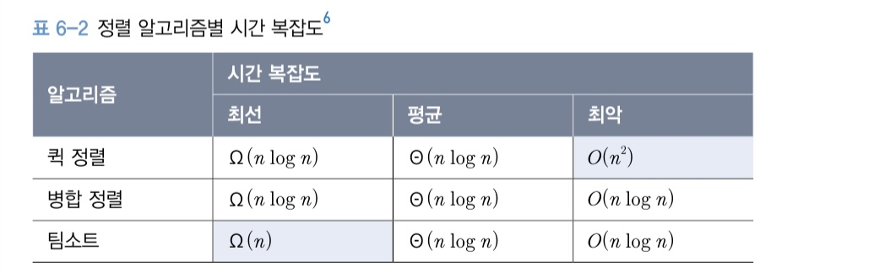
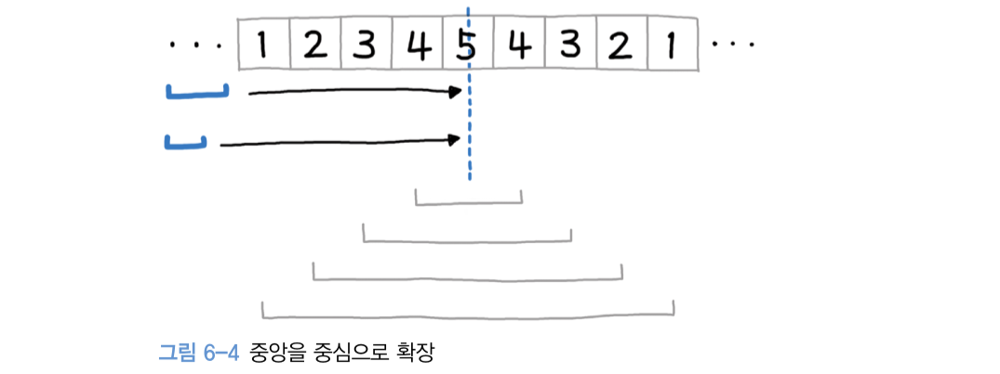
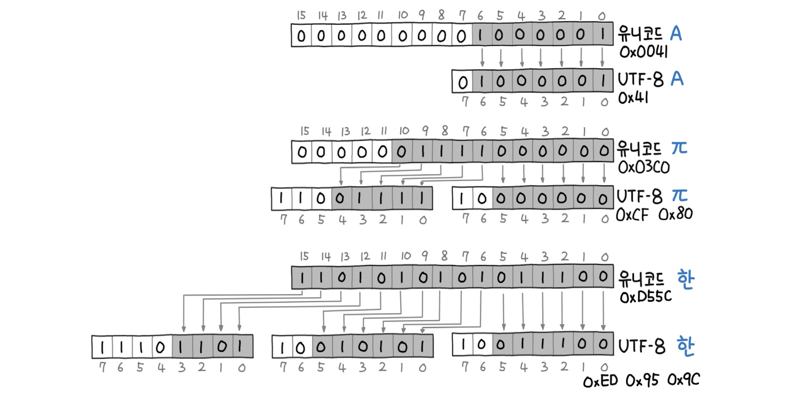

# 6장 문자열 조작

문자열 조작(String Manipulation)이란 문자열을 변경하거나 분리하는 등의 여러 과정을 말한다.

문자열 조작은 코딩 테스트에서 매우 빈번하게 출제되며, 실무에서도 다양한 분야에 쓰이는 주제

ex. 웹 페이지 탐색 등의 정보 처리 분야,

문자 메시지/이메일 등의 통신 시스템 분야,

컴파일러나 인터프리터 등을 다루는 프로그래밍 시스템 분야


## 1. 유효한 팰린드롬

leetcode 125. Valid Palindrome

```
💡 '팰린드롬'이란 
앞뒤가 똑같은 단어나 문장, 우리말로는 '회문'이라고 부른다.
ex) 소주 만 병만 주소
```

*주어진 문자열이 팰린드롬인지 확인하라. 대소문자를 구분하지 않으며, 영문자와 숫자만을 대상으로 한다.*


```python
def is_palindrome3(self, s: str) -> bool:  # 3. 슬라이싱 사용
    s = s.lower()
    # 정규식으로 불필요한 문자 필터링
    s = re.sub('[^a-z0-9]', '', s)

    return s == s[::-1]  # 슬라이싱
```


```
💡 문자열 슬라이싱 매우 편리하고 무엇보다 내부적으로 매우 빠르게 동작한다. 
위치를 지정하면 해당 위치의 배열 포인터를 얻게 되며, 
이를 통해 연결된 객체를 찾아 실제 값을 찾아낸다. 
이 과정은 매우 속도가 빠르므로 문자열 조작 시에는 항상 슬라이싱을 우선적으로 사용하는 편이 속도 개선에 유리하다.
```

```python
>>> S = '안녕하세요'
>>> print(S[1:4)
녕하세
>>> print(S[1:-2])
녕하
>>> print(S[:-3])
안녕
>>> print(S[-3:]
하세요

# 인덱스를 둘 다 생략하면 사본을 리턴한다.
# 파이썬은 a = b 와 같은 형태로 할당하면 
# 변수의 값이 할당되는 것이 아니라 a 변수가 b 변수를 참조하는 형태가 된다.
# 참조가 아닌 값 복사를 위해 [:]를 사용할 수 있으며,
# 이 방식은 문자열이나 리스트를 복사하는 Pythonic Way이기도 하다.
>>> print(S[:])
안녕하세요

# 뒤집기
>>> print(S[::1])
요세하녕안
```


## 2. 문자열 뒤집기

leetcode 344. Reverse String

*문자열을 뒤집는 함수를 작성하라. 입력값은 문자 배열이며, 리턴 없이 리스트 내부를 직접 조작하라.*

`reverse()` 는 리스트에만 제공하는 함수로, 리스트 값을 뒤집을 수 있다.

문자열이라면 문자열 슬라이싱을 사용 가능하고, 리스트에도 문자열 슬라이싱을 사용할 수 있다.

```python
s = s[::-1]
s[:] = s[::-1]
```


## 3. 로그 파일 재정렬

leetcode 937. Reorder Log Files

*로그를 재정렬하라. 기준은 다음과 같다.*

1. *로그의 가장 앞 부분은 식별자다.*
2. *문자로 구성된 로그가 숫자 로그보다 앞에 온다.*
3. *식별자는 순서에 여향을 끼치지 않지만, 문자가 동일할 경우 식별자 순으로 한다.*
4. *숫자 로그는 입력 순서대로 한다.*


```
💡 람다 표현식 
식별자 없이 실행 가능한 함수를 말하며, 
함수 선언 없이도 하나의 식으로 함수를 단순하게 표현할 수 있다. 
이 책에서는 주로 리스트 컴프리헨션을 사용하지만 람다 표현식이 꼭 필요한 경우가 있다.
```


## 4. 가장 흔한 단어

leet code 819. Most Common Word

*금지된 단어를 제외한 가장 흔하게 등장하는 단어를 출력하라.*

*대소문자 구분을 하지 않으며, 구두점(마침표, 쉼표 등) 또한 무시한다.*

문자열을 처리할 때는

데이터 클렌징(Data Cleansing)이라 부르는 입력값에 대한 전처리(Preprocessing) 작업이 필요하다.

정규식을 섞어 쓰면 좀 더 편리하게 처리할 수 있다.


## 5. 그룹 애너그램

leetcode 49. Group Anagrams

*문자열 배열을 받아 애너그램 단위로 그룹핑하라.*


```
💡 '애너그램'이란 
일종의 언어유희로 문자를 재배열하여 다른 뜻을 가진 단어로 바꾸는 것을 말한다. (어구전철)
```


## 파이썬의 여러 가지 정렬 방법

- `sort()` 메소드, 리스트 자체를 정렬, 제자리 정렬(In-place Sort)

  입력을 출력으로 덮어 쓰기 때문에 별도의 추가 공간이 필요하지 않으며,

  리턴값이 없다.

```python
alist.sort()  # 리스트 자체를 제자리 정렬
```

- `sorted()` 함수, 리스트 정렬

```python
>>> a = [2, 5, 1, 9, 7]
>>> sorted(a)
[1, 2, 5, 7, 9]

>>> b = 'zbdaf'
>>> sorted(b)
['a', 'b', 'd', 'f', 'z']
# 다시 문자열로 결합
>>> "".join(sorted(b))
'abdfz'
```

`key=` 옵션을 지정해 정렬을 위한 키 또는 함수를 별도로 지정할 수 있다.

```python
>>> c = ['ccc', 'aaaa', 'd', 'bb']
>>> sorted(c, key=len)
['d', 'bb', 'ccc', 'aaaa']
```

- 람다 표현식을 이용

```python
# 함수를 이용해 키를 정의하는 방법
a = 'cde', 'cfc', 'abc']

def fn(s):
    return s[0], s[-1]

print(sorted(a, key=fn))

# 출력 결과
# ['abc', 'cfc', 'cde']

# 람다 이용
>>> sorted(a, key=lambda s: (s[0], s[-1])
['abc', 'cfc', 'cde']
```


```
💡 정렬 알고리즘과 팀소트 
파이썬의 정렬은 팀소트(Timsort)를 사용한다. 
2002년 팀 피터스가 파이썬을 위해 C로 구현한 알고리즘이다. 
팀소트는 애초에 '실제 데이터는 대부분 이미 정렬되어 있을 것이다'라고 가정하고 
실제 데이터에서 고성능을 낼 수 있도록 설계한 알고리즘이다. 
온라인 코딩 테스트 시에는 별다른 제약사항이 없는 한, 
가급적 파이썬의 내장 함수를 사용하는 편이 실행 속도가 가장 빠르다.
```



→ 팀소트는 이미 정렬되어 있는 경우 비교를 건너뛰기 때문에 최선의 경우 Ω(n)까지 가능하다.

→ 병합 정렬과 퀵 정렬을 제치고 현업에서 가장 널리 쓰이는 정렬 알고리즘이다.

→ 자바나 스위프트 등의 개발 언어나 안드로이드, 크롬 등의 플랫폼에까지 다양하게 영향을 미쳤다.


## 6. 가장 긴 팰린드롬 부분 문자열

leetcode 5. Longest Palindrome Substring

*가장 긴 팰린드롬 부분 문자열을 출력하라.*

투 포인터가 중앙을 중심으로 확장하는 형태



2칸, 3칸으로 구성된 투 포인터가 슬라이딩 윈도우처럼 계속 앞으로 전진해나간다.

이 때 윈도우에 들어온 문자열이 팰린드롬인 경우 그 자리에 멈추고, 투 포인터가 점점 확장하는 식

팰린드롬은 짝수 혹은 홀수일 수 있으므로 두 경우에 대해 모두 판별한다.

1. 예외 처리 (팰린드롬에 해당할 수 없는 문자열)
2. 슬라이딩 윈도우 우측으로 이동
3. 팰린드롬 판별 및 투 포인터 확장 (`expend()` 로 정의한 중첩 함수에서 홀수, 짝수 2개의 투 포인터가 팰린드롬 여부를 판별)


```
💡 슬라이싱과 인덱스 
슬라이싱은 n-1만큼 출력되며, 인덱스 조회는 해당 인덱스의 값이 나온다. 
코딩 테스트 시 헷갈리는 부분이고 버그의 주범이 되므로, 
반드시 잘 숙지하자.
```


### 유니코드와 UTF-8

초기에 문자를 표현하던 대표적인 방식은 `ASCII` 인코딩 방식으로 1바이트에 모든 문자를 표현했다.

한비트는 체크섬으로 제외하여 7비트, 총 128글자로 문자를 표현했는데,

한글, 한자 같은 문자는 2개 이상의 특수 문자를 합쳐서 표현하여 깨지거나 제대로 표현되지 않는 경우가 잦았다.

이런 문제를 해결하기 위해,

2~4바이트의 공간에 여유 있게 문자를 할당하고자 등장한 방식이 바로 `유니코드`다.

그러나 유니코드 자체는 1바이트로 표현 가능한 영문자도 2바이트 이상의 공간을 사용하기 때문에 메모리 낭비가 심하다.

따라서 효율적으로 문자를 인코딩하기 위해,

유니코드의 가변 길이 문자 인코딩 방식인 `UTF-8`이다.

파이썬이 버전 3으로 넘어오면서 가장 큰 변화 중 하나는 바로 문자열의 처리 방식이다.

심지어 기존 CPython에서 문자열을 처리하던 `stringobject.c` 는 아예 `unicodeobject.c` 로 이름과 구현까지 변경되는 큰 변화가 있었다.

문자열은 모두 유니코드 기반으로 전환됐고 영어뿐만 아니라 한글, 한자 등의 다국어를 출력하는 데 아무런 불편함이 없게 되었다.

### UTF-8의 내부 구조

이진 포맷은 매우 간단하면서도 직관적이다.

시작 비트에 따라 0, 10, 110, 1110인 경우 각각 1, 2, 3, 4바이트 문자임을 인식할 수 있다.


유니코드 값에 따라 가변적으로 바이트를 결정하여 불필요한 공간 낭비를 절약할 수 있다.



1. 'A'

   `ASCII` 문자이며 7비트 이내에 표현할 수 있다. 맨 앞 비트를 0으로 두고 1바이트로 표현 가능

2. 'π'

   2바이트로 표현 가능하기 때문에 110, 10을 각각 맨 앞 비트로 표현한다.

3. '한'

   3바이트로 표현해야 하고 1110, 10, 10을 각각 맨 앞 비트로 하여 표현한다.

   유니코드에는 완성형 한글 11,172자 뿐만 아니라 조합형 자모가 모든 포함되어 있으며,

   한글을 UTF-8 인코딩 값은 모두 각 문자당 3바이트를 차지한다.


```
💡 유니코드 인코딩 
파이썬 버전 3부터 유니코드로 모든 문자열을 표현하지만, 
사실 파이썬 내부에서는 UTF-8 인코딩을 사용하지 않는다. 
인덱스를 통해 개별 문자에 접근하기가 어렵기 때문이다.

문자열 슬라이싱 등 문자에 인덱스로 접근할 수 있는 다양한 방식을 제공하는데, 
UTF-8으로 인코딩한다면 문자마다 바이트 길이가 달라진다. 
이렇게 되면 전체 문자열을 스캔하지 않는 한 원하는 인덱스에 빠르게 접근할 수 없다. 
따라서 고정 길이 인코딩 방식이 필요하다.

모든 문자열이 ASCII 범위 내에 있다면 `Latin-1 인코딩`(고정 1바이트 인코딩)을 사용하고, 
이외의 대부분 문자열은 `UCS-2`(고정 2바이트 인코딩)로 2바이트 인코딩을 한다. 
특수, 기호, 그림, 이모티콘, 희귀 언어 등이 포함된 문자열이라면 `UCS-4`(고정 4바이트 인코딩)로 4바이트 인코딩을 한다.

문자열에 포함된 문자 범위에 따라 서로 다른 고정 인코딩 방식을 택함으로써, 
내부적으로 파이썬은 문자열 슬라이싱을 포함한 원하는 인덱스에 빠르게 접근할 수 있게 하는 방식을 택하고 있다.
```