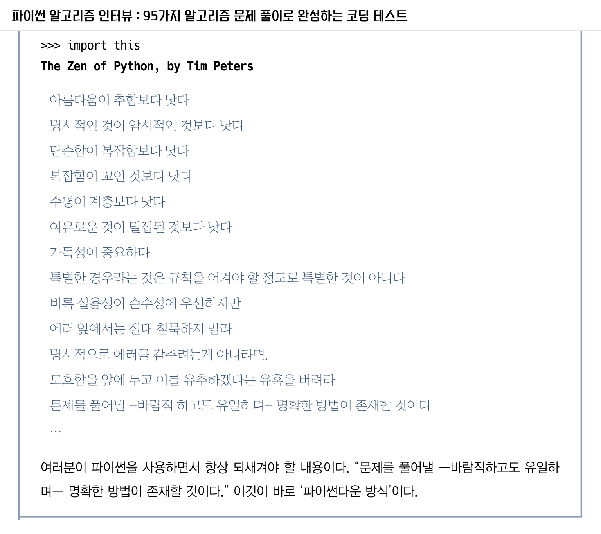

# 2부 파이썬
파이썬 코딩 스타일, 빅오(알고리즘의 시간 복잡도), 파이썬의 자료형, 리스트, 딕셔너리, 문자열 조작, 알고리즘 문제 풀이

# 3장 파이썬

1989년 네덜란드 컴퓨터과학자 귀도 반 로섬(Guido Van Rossum)은 프로그래밍 언어의 한계를 맞딱뜨리게 되자, 크리스마스 프로젝트로 새로운 언어를 직접 만들어보기로 결심한다. 원칙은 다음과 같다. 

1. 읽기 쉽도록 - 중괄호 대신 인덴트 처리한 공백
2. 사용자가 원하는 모듈 패키지 제작 가능, 다른 프로그램에서 사용 가능 - 나중에 이 방식은 계속 발전해 easy_install 을 거쳐 pip를 통해 패키지 인덱스를 제공하는 형태로 완성, 다른 언어에서 많은 영향
3. 독특하고 신비한 이름 - 70년대 세계를 풍미한 영국의 코미디 그룹 몬티 파이썬(Monty Python)

파이썬은 문법이 매우 쉬어 입문자들이 프로그래밍을 처음 배울 때 가장 먼저 추천되는 언어이다.

실행 가능한 수도코드(Executable Pseudocode)라는 별칭으로도 불린다.

수도코드란 실행되지 않는 알고리즘 기술 코드인데, 파이썬은 그 정도로 간결하면서도 실행까지 가능하다는 의미

그뿐 아니라 실무에서도 널리 쓰이고 있다.

특히 딥러닝의 물결과 함께 인공지능을 주도하는 표준 언어로 주목받고 있다.

파이썬은 한쪽에서는 입문용으로 초등학생들이 배우고,

다른 한쪽에서는 컴퓨터과학 박사들이 세계 최고 수준의 학회에 제출할 논문을 작성하는 데 사용한다.

### 파이썬에 대한 이해

코딩 테스트 풀이 언어로 파이썬을 선택했다면,

적어도 그 언어의 세부 구현까지 상세히 알고 있어야 문제를 제대로, 신속하고, 정확하게 풀 수 있다.

우리가 흔히 '삽질'이라고 부르는 일들은 제대로 알지 못하는 데에서 비롯된다. 

아무리 쉬운 도구라도 제대로 사용법을 숙지해야 제대로 사용할 수 있다.

최적의 문제 풀이가 가능하도록 내장 라이브러리, 자료구조, 알고리즘에 대해 상세히 다룬다.

`NumPy` , 객체 지향 프로그래밍(OOP) 등은 다루지 않는다.

### 파이썬 문법

기본 문법에서 나아가 개발 역량을 한 단계 높여줄 고급 문법을 살펴본다.

- **인덴트**

    인덴트(Indent)는 공식 가이드인 PEP 8에 따라 공백 4칸을 원칙으로 한다.

    ```python
    foo = long_function_name(var_one, var_two,
    												 var_three, var_four)

    def long_function_name(
    				var_one, var_two, var_three,
    				var_four):
    		print(var_one)

    foo = long_function_name(
    		var_one, var_two,
    		var_three, var_four)
    ```

    → 파라미터를 다른 행과 구분되게 하여 보기 좋게 맞춘다.

    → 파이참을 이용하면 별도로 신경쓰지 않아도 코딩 가이드를 자동으로 맞춰준다.

    → 또는 파이참에서 `Reformat Code` 를 실행하면 자동으로 PEP 8 기준에 맞춰준다.

- **네이밍 컨벤션**

    파이썬의 변수/함수명 네이밍 컨벤션(Naming Convention)은 각 단어를 밑줄(_)로 구분하는 스네이크 케이스(Snake Case)를 따른다.

    ```python
    # 카멜 케이스
    camelCase: int = 1
    # 스네이크 케이스
    snake_case: int = 1
    ```

- **타입 힌트**

    파이썬은 동적 타이핑 언어임에도 타입을 지정할 수 있는 타입 힌트가 PEP 484 문서에 추가됐다.

    이 기능은 파이썬 버전 3.5부터 사용할 수 있다.

    Cpython 의 `typing.py` 에 선언할 수 있는 타입이 명시되어 있다.

    ```python
    a: str = "1"
    b: int = 1

    # def fn(a) 대신 다음과 같이 타입 힌트 사용으로, 가독성이 좋아지고 버그 발생 확률이 줄어든다.
    def fn(a: int) -> bool:
    ```

    → 코딩 테스트에서는 굳이 지정하지 않아도 문제는 없다.

    → 그러나 코드를 정리할 때만이라도 타입을 모두 지정해서 보기좋게 제출한다면, 코드 리뷰 시 면접관에세 좋은 점수를 받을 수 있을 것이다.

    온라인 코딩 테스트 시 `mypy` 를 사용하면 타입 힌트에 오류가 없는지 자동으로 확인할 수 있다.

    ```python
    $ pip install mypy
    $ mypy solution.py
    # Incompatible return value type 오류 발생
    # ex) got "str", expected "int"
    ```

- **리스트 컴프리헨션**

    파이썬은 `map` , `filter` 와 같은 함수형 기능을 지원하며 람다 표현식(Lambda Expression)도 지원 (버전 1.0, 1994년)

    ```python
    >>> list(map(lambda x: x + 10, [1, 2, 3]))
    [11, 12, 13]
    ```

    그러나 훨씬 더 유용한 기능은 리스트 컴프리헨션(List Comprehension)이다. (버전 2.0부터 지원)

    리스트 컴프리헨션이란 기존 리스트를 기반으로 새로운 리스트를 만들어 내는 구문이다.

    이는 다방면에 유용하게 활용되며, 무엇보다 람다 표현식에 `map`이나 `filter`를 석어서 사용하는 것에 비해 가독성이 훨씬 높다.

    ```python
    # 홀수인 경우 2를 곱해 출력하라는 리스트 컴프리헨션
    >>> [n * 2 for n in range(1, 10 + 1) if n % 2 == 1]
    [2, 6, 10, 14 ,18]
    ```

    버전 2.7 이후에는 딕셔너리 등이 가능하도록 추가됐다.

    ```python
    a = {key: value for key, value in original.items()}
    ```

    → 대체로 표현식은 2개를 넘지 않는 것이 가독성에 좋다.

- **제너레이터**

    제너레이터(Generator)는 2001년 파이썬 버전 2.2부터 추가된 기능으로, 

    루프의 반복(iteration) 동작을 제어할 수 있는 루틴 형태를 말한다.

    `yield` 구문을 사용하면 제너레이터를 리턴할 수 있다.

    → `return` 구문은 값을 리턴하고 모든 함수의 동작을 종료한다는 의미이지만, `yield` 는 제너레이터가 여기까지 실행 중이던 값을 내보낸다, 양보한다는 의미이다.

    → 중간값을 리턴한 다음 함수는 종료되지 않고 계속해서 맨 끝에 도달할 때까지 실행된다.

    → 값을 생성하려면 `next()` 로 추출하면 된다.

    ```python
    def get_natural_number():
    		n = 0
    		while True:
    				n += 1
    				yield n

    g = get_natural_number()
    for _ in range(0, 100):
    		print(next(g))
    ```

    제너레이터는 여러 타입의 값을 하나의 함수에서 생성하는 것도 가능하다.

    ```python
    def generator():
    		yield 1
    		yield 'string'
    		yield True

    g = generator()
    print(next(g))
    ```

- **range**

    제너레이터의 방식을 활용하는 대표적인 함수로 `range()` 가 있다. 주로 for문에 사용

    ```python
    >>> list(range(5))
    [0, 1, 2, 3, 4]

    >>> range(5)
    range(0, 5)

    >>> type(range(5))
    <class 'range'>

    >>> for i in range(5):
    				print(i, end=' ')
    0 1 2 3 4
    ```

    이 코드에서 `range()` 는 `range` 클래스를 리턴하며, 

    for 루프에서 사용할 경우 내부적으로는 제너레이터의 `next()` 를 호출하듯 매번 다음 숫자를 생성해낸다.

    버전 3 이후 `range()` 함수가 제너레이터 역할을 하는 `range` 클래스를 리턴하는 형태로 변경됐고 `xrange()` 함수는 사라졌다.

    `range` 클래스를 이용하면 생성 조건만 보관하게 된다.

    인덱스로 접근 시에는 바로 생성하도록 구현되어 있기 때문에 리스트와 거의 동일한 느낌으로 불편 없이 사용할 수 있다.

    ```python
    # 이미 생성된 값
    # 100만 개의 숫자를 생성, 메모리 공간 차지 및 생성 시간이 길다
    a = [n for n in range(10000000)]
    # 메모리 점유율: 8697464

    # 생성해야 한다는 조건
    # 제너레이터를 리턴하듯 range 클래스를 사용하면
    # 생성 조건만 정해두고 나중에 필요할 때 생성해서 꺼내 쓸 수 있다
    b = range(10000000)
    # 메모리 점유율: 48
    ```

- **enumerate**

    `enumerate()` 는 '열거하다'는 뜻의 함수로, 순서가 있는 자료형(list, set, tuple 등)을 인덱스를 포함한 `enumerate` 객체로 리턴한다.

    ```python
    >>> a = [1, 2, 3, 2, 45, 2, 5]
    		list(enumerate(a))
    [(0, 1), (1, 2), (2, 3), (3, 2), (4, 45), (5, 2), (6, 5)]
    ```

    → 이처럼 `list()` 로 결과를 추출할 수 있는데, 인덱스를 자동으로 부여해주기 때문에 매우 편리하다.

    리스트의 인덱스와 값을 함께 출력하려면 어떻게 해야 할까?

    ```python
    for i, v in enumerate(a):
    print(i, v)
    ```

    → 인덱스와 값 모두 한 번에 깔끔하게 처리된다.

- **// 나눗셈 연산자**

    `//` 연산자는 정수형을 나눗셈할 때 동일한 정수형을 결과로 리턴하면서 내림(Floor Division) 연산자의 역할을 한다.

    즉 몫(Quotient)을 구하는 연산자이다.

    ```python
    # (a // b)는 int(a / b)와 동일하다
    >>> 5 // 3
    1

    >>> type(5 // 3)
    <class 'int'>

    >>> type(int(5 / 3))
    <class 'int'>
    ```

     c.f. 나머지(Remainder)를 구하는 모듈로(modulo) 연산자는 `%` 이다.

    몫과 나머지를 동시에 구하려면 `divmod()` 함수를 사용하면 된다.

    ```python
    >>> divmod(5, 3)
    (1, 2)
    ```

- **print**

    코딩 테스트 시에는 디버거 사용 및 TDD 방식의 접근이 어렵기 때문에 `print()` 가 디버깅을 위해 제공되는 유일한 기능이다.

    이를 좀 더 유용하게 활용할 수 있는 방법을 살펴보자.

    ```python
    # ,(콤마) 사용
    >>> print('A1', 'B2')
    A1 B2

    # sep 파라미터로 구분자 지정
    >>> pirnt('A1', 'B2', sep=',')
    A1,B2

    # end 파라미터를 공백으로 처리하여 줄바꿈 제한
    >>> print('aa', end=' ')
    		print('bb')
    aa bb

    # 리스트 출력 시 join()으로 묶어서 처리
    >>> a = ['A', 'B']
    >>> print(' '.join(a))
    A B

    # idx = 1, fruit = "Apple" 일 때,
    # idx 값에 1을 더해서 fruit와 함께 출력하는 방법
    >>> print('{0}: {1}'.format(idx + 1, fruit))
    2: Apple

    # 인덱스 생략 가능
    >>> print('{}: {}'.format(idx + 1, fruit))
    # f-string(formated string literal)
    # 템플릿을 사용하듯 인라인으로 변수 삽입 가능
    # 기존의 % 사용 및 .format 방식보다 간결하고 직관적이며 속도도 빠르다.
    # 파이썬 3.6 이상부터 지원
    >>> print(f'{idx + 1}: {fruit}')
    ```

- **pass**

    코딩을 하다 보면 코드의 전체 골격을 잡아 놓고 내부에서 처리할 내용은 차근차근 생각하며 만들겠다는 의도로 다음과 같이 코딩하는 경우가 있다.

    `pass` 는 이러한 경우 오류를 막는 역할을 한다. (인덴트 오류 등)

    ```python
    class MyClass(object):
    		def method_a(self):
    				# 여기에 pass 추가
    				pass

    		def method_b(self):
    				print("Method B")

    c = MyClass()
    ```

    → `pass` 는 널 연산(Null Operation)으로 아무것도 하지 않는 기능이다.

    → `pass` 를 지정하면 불필요한 오류를 방지할 수 있다.

    → 목업(mockup) 인터페이스부터 구현한 다음에 추후 구현을 진행할 수 있게 한다. 온라인 코딩 테스트 시에도 무척 유용하게 활용할 수 있다.

- **locals**

    `locals()` 는 로컬 심볼 테이블 딕셔너리를 가져오는 메소드이다. 업데이트도 가능

    로컬에 선언된 모든 변수를 조회할 수 있는 명령, 디버깅에 도움

    로컬 스코프에 제한해 정보를 조회할 수 있기 때문에, 함수 내부의 로컬 정보를 조회해 잘못 선언한 부분이 없는지 확인하는 용도로 활용할 수 있다.

    로컬 스코프에 정의된 모든 변수를 출력, 일일이 변수명 찾아낼 필요가 없어 편리하다.

    ```python
    import pprint
    pprint.pprint(locals())

    # 출력 결과
    {'nums': [2, 7, 11, 15], 
    'pprint': <module 'pprint' from '/usr/lib/python3.8/pprint.py'>, 
    'self': <__main__.Solution object at 0x7f0994769d90>, 
    'target': 9}
    ```

     → 클래스 메소드 내부의 모든 로컬 변수를 출력해 주기 때문에 디버깅에 많은 도움이 된다.

### 코딩 스타일

점수를 기계적인 방식으로 측정하는 온라인 코딩 테스트에서 코딩 스타일은 중요하지 않다.

그러나 채용을 위한 코딩 테스트는 점수만 보지 않고, 제출한 코드의 품질을 평가할 수 있다.

코드가 엉망이라면 `왜 코드를 이렇게 작성했나요?` 에 대한 엄청난 질문에 시달리게 될 것이고, 제대로 대답하지 못하면 결과는 당연히 좋지 않을 것이다.

좋은 코드에 정답은 없다. 그러나 많은 사람이 선호하는 방식은 있다.

좋은 코드는 가능한 한 많은 사람이 좋아하며 선호하는 방식은 택하는 것이 중요하다. 개발은 혼자서만 하는 것이 아니며, 좋은 코드란 모두가 이해할 수 있을 때 더 높은 가치를 발휘하기 때문이다.

이 책은 가능한 파이썬다운 방식에 ㅁㅈ춰서 작성하도록 노력했다. 이 책의 코딩 스타일을 참고하면 좋은 파이썬 코드를 작성하는 데 많은 도움이 될 것이다.

흔히 코드에서 냄새(Code Smell)이 난다고 표현하는데, 좋은 코드는 얼핏 쳐다 보기만 해도 향기가 나고 나쁜 코드는 그 반대다.

여러분 또한 좋은 코드를 만들어 향기를 내뿜기를 바란다.

- 변수명과 주석

    변수명이 무엇을 의미하는지, 어떻게 동작하는지에 대한 주석을 상세히 다는 방식이 좋다.

    ```python
    def num_matching_subseq(self, S: str, words: [str]) -> int:
    		matched_count = 0

    		for word in words:
    				pos = 0
    				for i in range(lend(word)):
    						# Find matcing postion for each character.
    						found_pos = S[pos:].find(word[i])
    						if found_pos < 0:
    								matched_count -= 1
    								break
    						else: # If found, take step position forward.
    								pos += found_pos + 1
    				matched_count += 1

    		return matched_count
    ```

    → 간단한 주석을 부여하는 편이 훨씬 더 가독성이 높아 보인다.

    → 변수명 또한 각각의 의미를 부여해 작명하고 스네이크 케이스로 작성하는 것이 좋다.

    → 주석은 한글도 달아도 무방하지만 영어로 읽고 작성하는 것에도 부담이 없어야 한다.

    코딩 테스트 시에도 영어로 주석을 달아서 제출하는 편이 좀 더 프로페셔널하다는 인상을 줄 수 있다.

    → 항상 주석을 상세하게 달아두는 편이 좋다.

    부가 설명을 추후에 덧붙일 수 있지 않고, 심사 시 제출한 결과물에 대해 주석 여부를 확인하기 때문이다.

    또한 인터뷰 시에는 해당 주석에 대해 함께 논의해볼 수도 있다.

- 리스트 컴프리헨션

    특유의 문법과 의미를 축약하여 나타낼 수 있는 특징때문에 가독성을 떨어트리는 요인이 되기도 한다.

    역할별로 줄 구분을 하여 모두 풀어서 쓰는 것이 가독성에 더 좋을 수 있다.

    → 코드를 읽는 방향이 위에서 아래까지 차례대로 정방향이기 때문에 훨씬 더 이해하기가 쉽다.

    또한 리스트 컴프리헨션은 대체로 표현식이 2개를 넘지 않아야 한다.

    ```python
    # 한 줄 풀이
    str1s = [str1[i:i + 2].lower() for i in range(len(str1) - 1) if re.findall('[a-z]{2}', str1[i:i + 2].lower())]
    # 역할별로 줄 구분
    str1s = [
    		str1[i:i + 2].lower() for i in range(len(str1) - 1)
    		if re.findall('[a-z]{2}', str1[i:i + 2].lower())
    ]
    # 모두 풀어서
    str1s = []
    for i in range(len(str1) - 1):
    		if re.fundall('[a-z]{2}', str1[i:i + 2].lower()):
    				str1s.append(str1[i:i + 2].lower())
    ```

- 구글 파이썬 스타일 가이드

    구글 파이썬 스타일 가이드는 구글에서 정한 스타일 가이드로, PEP 8에서는 설명하지 않은 좋은 코드를 위한 지침들이 있다.

    특히 가독성을 높이기 위한 지침들이 많아, '코딩 스타일;과도 잘 부합하는 주제이므로 몇 가지를 살펴보자.

    1. 함수의 기본 값으로 가변 객체(Mutable Obejct)를 사용하지 않아야 한다.

        함수가 객체를 수정하면 기본값이 변경되기 때문이다. 따라서 기본값으로 []나 {}를 사용하는 것은 지양해야 한다.

        대신 불변 객체(Immutable Object)를 사용한다. None을 명시적으로 할당하는 것도 좋은 방법이다.

        ```python
        # No
        def foo(a, b=[]):
        # Yes!
        def foo(a, b=None):
        		if b is None:
        				b = []

        # No
        def foo(a, b: Mapping = {}):
        # Yes!
        def foo(a, b: Optional[Sequence] = None):
        		if b is None:
        				b = []
        ```

    2. `True`, `False` 를 판별할 때는 암시적(Implicit)인 방법을 사용하는 편이 가독성이 높다.

        ```python
        # 1. False 판별
        # 굳이 False임을 판별할 필요가 없다.
        # No
        if foo != []:
        # Yes!
        if foo:

        # 2. 길이가 없다 -> 값이 없다
        # No
        if len(users) == 0:
        # Yes!
        if not users:

        # 3. 정수 처리 시 암시적 거짓 여부 판별보다는 
        # 비교 대상이 되는 정수값을 직접 비교
        # No
        if foo is not None and not foo:
        # Yes!
        if foo == 0:

        # 4. 연산 결과를 암시적 거짓 여부로 판별하는 것은 위험하다.
        # 0인 것은 정수로 처리하자.
        # No
        if not i % 10:
        # Yes!
        if i % 10 == 0:
        ```

    3. 세미콜론으로 줄을 끝내서는 안 되며, 세미콜론을 사용해 같은 줄에 두 문장을 써서도 안 된다.

         

    4. 최대 줄 길이는 80자로 한다.

        가조 길이는 길어서는 안 된다는 암묵적인 약속과 동시에 구글 스타일 가이드에서도 제한하고 있다.

파이썬 철학

파이썬에는 파이썬다운 방식(Pythonic Way)라는 고유한 철학이 있다. 언어차원에서 Zen of Python이라는 이름으로 제공한다. 소팅 알고리즘인 팀소트(Timsort)를 만든 팀 피터스(Time Peters)가 정의한 내용으로,`import this` 명령으로 실행할 수 있다.

"문제를 풀어낼 - 바람직하고도 유일하며 - 명확한 방법이 존재할 것이다."

