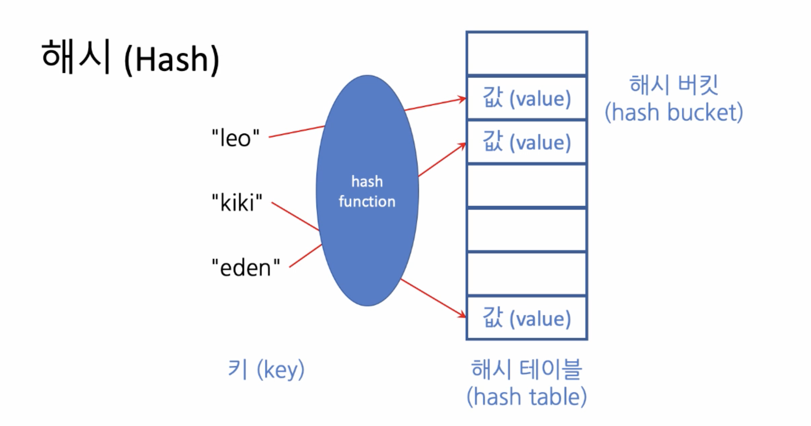

# 1. 해시(Hash) - 완주하지 못한 선수
문제의 첫인상이 중요하다. (어떤 데이터 표현을 알지, 어떤 알고리즘을 적용할지 좌우된다.)   

### 문제의 지문으로부터 명확히 알아내야 할 것
- 문제의 크기는 무엇에 지배되는지
- 어떤 제약이 존재하는지
- 주어진 조건이 무엇인지

### 
## 완주하지 못한 선수
###### 문제 설명

수많은 마라톤 선수들이 마라톤에 참여하였습니다. 단 한 명의 선수를 제외하고는 모든 선수가 마라톤을 완주하였습니다.

마라톤에 참여한 선수들의 이름이 담긴 배열 participant와 완주한 선수들의 이름이 담긴 배열 completion이 주어질 때, 완주하지 못한 선수의 이름을 return 하도록 solution 함수를 작성해주세요.

##### 제한사항

- 마라톤 경기에 참여한 선수의 수는 1명 이상 100,000명 이하입니다.
- completion의 길이는 participant의 길이보다 1 작습니다.
- 참가자의 이름은 1개 이상 20개 이하의 알파벳 소문자로 이루어져 있습니다.
- 참가자 중에는 동명이인이 있을 수 있습니다.

##### 입출력 예

| participant                             | completion                       | return |
| --------------------------------------- | -------------------------------- | ------ |
| [leo, kiki, eden]                       | [eden, kiki]                     | leo    |
| [marina, josipa, nikola, vinko, filipa] | [josipa, filipa, marina, nikola] | vinko  |
| [mislav, stanko, mislav, ana]           | [stanko, ana, mislav]            | mislav |

##### 입출력 예 설명

예제 #1
leo는 참여자 명단에는 있지만, 완주자 명단에는 없기 때문에 완주하지 못했습니다.

예제 #2
vinko는 참여자 명단에는 있지만, 완주자 명단에는 없기 때문에 완주하지 못했습니다.

예제 #3
mislav는 참여자 명단에는 두 명이 있지만, 완주자 명단에는 한 명밖에 없기 때문에 한명은 완주하지 못했습니다.

### 
## 풀이 요령
- 동명이인이 있을 수 있고 참가자는 10만명 이하이기 때문에 어떤 특정한 이름의 참가한 사람 수를 세고 그 이름의 완주한 사람 수가 같으면 모두 완주한 것이 된다. 그러나 딱 한 명 완주하지 못한 사람은 같은 이름 중 하나의 이름이 완주한 선수 명단에 존재하지 않게 된다.
- 이름이 몇번이나 배열에 등장했는지, 이름에 대한 수를 기록하고 저장할 수 있는 것을 원하게 된다.

### 
## 자료구조(와 알고리즘)의 선택
### 만약 이름 대신 번호가 주어졌다면?
크기 10만을 가지는 선형 배열 (linear array)
-> 인덱스를 통해 바로 접근이 가능하기 때문에 몇번 선수가 완주했는지 알 수 있다.

### 번호 말고 다른 것 (예: 문자열)로 접근할 수 있는 좋은 자료 구조는 없을까?

### 
## 해시 (Hash)
##### 해시
해시 테이블(hash table)이라는 저장 공간 내에 키(key)의 위치를 정해서 값(value)을 저장하는 것을 말한다. 
인덱스 대신 원소를 찾아갈 수 있는 수단을 키(key)라고 부른다.

##### hash function
키(key)를 해시 테이블(hash table)에 값(value)으로 저장할 때는 hash function을 이용한다. (Hash function의 구성은 다루지 않음)
##### hash bucket
해시 테이블(hash table) 내의 각각의 칸들을 해시 버킷(hash bucket)이라고 부른다.
버킷의 수가 많을수록 서로 다른 키가 서로 다른 버킷에 사상(mapping)될 수 있는 가능성이 높아진다.


##### 충돌 (collision)
두 개 이상의 키(key) 값이 해시 테이블의 같은 버킷(bucket)을 가리킬 때 해시 충돌이 일어났다고 표현한다.
충돌은 반드시 해결해야 하는데, 해결 방법으로는 
- 해시 테이블 옆으로 버킷들을 늘어놓으면서 값(value)을 연달아 저장하고 해당 값들에 맞는 키 값을 적어놓는다.

### 
## 문제의 풀이 - 예제
##### 입출력 예
| participant | completion | return |
| ---| --- | --- |
| [mislav, stanko, mislav, ana] | [stanko, ana, mislav] | mislav |

##### participant hash table
| key | value |
| ---| --- |
| mislav | 2 |
| stanko | 1 |
| ana | 1 |

##### participant hash table에서 completion key 값에 해당하는 value를 -1
| key | value |
| ---| --- |
| mislav | 1 |
| stanko | 0 |
| ana | 0 |

### 
## Solution

```python
def solution(participant, completion):
    d = {}
    for x in participant:
        d[x] = d.get(x, 0) + 1
    for x in completion:
        d[x] -= 1
    dnf = [k for k, v in d.items() if v > 0]
    answer = dnf[0]
    return answer
```


